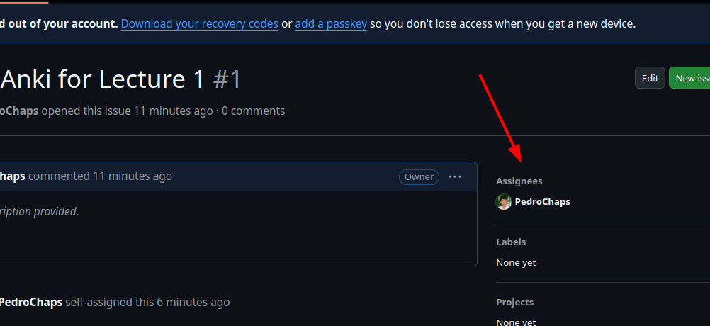

# 2425-ETH-NetSec-Exam-Anki
This repo holds Anki decks for different contents of the NetSec course of the 2024-2025 academic year of ETH.

There are different types of decks: 
- Normal lectures (`lec<nr>_
`)
- Invited guest lectures (`invited<nr>_
`)
- Exercises (`ex<nr>_
`)
- Projects (`proj<nr>_<type>`)

# Contribute

It's very easy to contribute! :D
- Check the issues for unclaimed Ankis
- Assign it to yourself:
  
- Add some comments to keep people posted
  
- Create a branch, commit to it, and do an MR when the deck is ready!