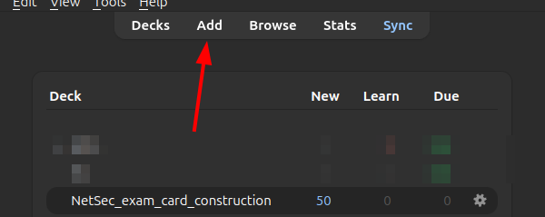
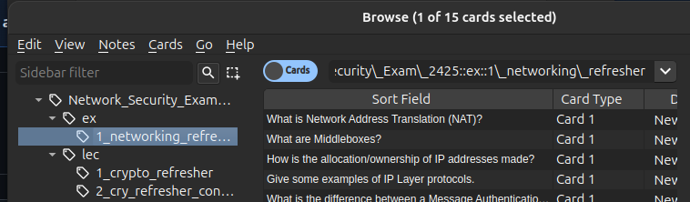

# 2425-ETH-NetSec-Exam-Anki

## Introduction

This repo holds Anki decks for the exam of the NetSec course of the 2024-2025 academic year of ETH.

There are different types of decks: 
- Normal lectures (`lec<nr>_
`)
- Invited guest lectures (`invited<nr>_
`)
- Exercises (`ex<nr>_
`)
- Projects (`proj<nr>_<type>`)

## Contribute

It's very easy to contribute! :D
- Ask me to add you to the repo as a contributor
- Check the issues for unclaimed Ankis
- Assign one for yourself:
  
- Add some comments to keep people posted
  
- Be sure to follow the [Anki format](#ankis-format) and create the relevant Anki cards
- Export them (check the [How to export](#how-to-export) section for help)
- Create a branch, add the deck and remove the associated `TODO_<type><nr>_XXX.apkg` file, commit, and do an MR when the deck is ready!

## Anki's format

The following format is used to ensure better organization and integration (ty @afn478 :D).

Despite all the different deck files in the repo, they are all part of a "main deck" named `Network_Security_Exam_2425`.
It is done this way so it's easier to cooperate (by having different files), but the cards remain neatly organized within Anki (as, otherwise, we'd need to manage >40 decks)

To differentiate from different decks, tags are used. They are of the form `Network_Security_Exam_2425::<type>::<nr>_
` (e.g., `Network_Security_Exam_2425::ex::2_TLS_I`).

**Note**: If you are contributing, use a deck with a name different than `Network_Security_Exam_2425`, as it will cause conflicts.

So, to add your first card, if you do not have a deck, create one:

Select it and click "Add":

Fill in the fields and add it to the deck:

Then, to filter for specific classes, tags can be used in the Browse menu:

You can also add tags later (good if you forgot while creating the cards):
1. Select your newly added cards (you can sort them by date)
   
2. Click on "Notes" > "Add Tags..."
   
3. Add the appropriate tag!

## Guides

(ty @afn478 for the [How to import](#how-to-import) and [How to export](#how-to-export) guides)

### How to import

This section shows how to import decks to Anki.

If you are reading this after all Anki decs are finished, the "main deck" will probably be available as a single file, so that one can be be used.
Otherwise, all decks need to be imported individually, or an Anki extension needs to be used instead.

1. Click "Import File"
   
2. Select the deck that you want to import
   
3. Click import
   
4. The cards will be
### How to export

When you are ready to export your cards,
1. Go to the Browse menu and filter by tag:
  
2. Go to "Edit" > "Create Filtered Deck"
   
3. Set the options as shown in the red boxes and click "Build"
   
4. A deck with the cards will appear. Export it by clicking in the Cog. Ensure that it is named **exactly** **`Network_Security_Exam_2425`** (watchout for leading `+`s) and, if not, rename it:
  
1. Export the deck:
  
1. Save the deck in the project directory with the corresponding name
2. Delete the filtered deck
   